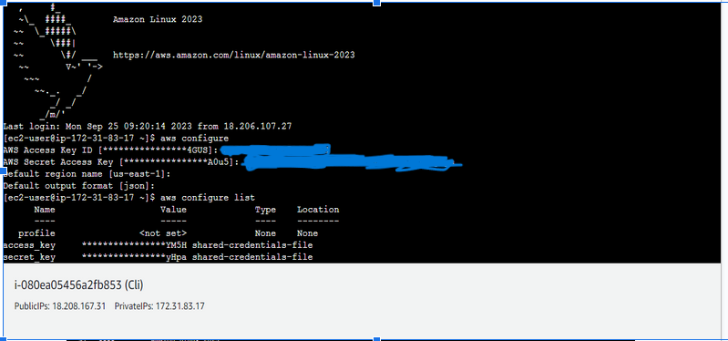

# Creating EC2 Instance with AWS CLI 

This is a project about creating an EC2 Instance using AWS CLI and Identity and Access Management (IAM) account.

The process involves:

First, creating an IAM user account and granting the user access to the EC2 service using the root user account.

Next, log into the AWS management console via the IAM user account using the username, password and Account ID provided by the root user.

Once logged in, configure your AWS through the CLI using the code as shown in the image below:

The Access Key ID and secret access Key are provided by the root user.

Now that the AWS has been configured, it's time to create an EC2 instance.

Create the EC2 instance using the code in the image below:

To add tags to your Instance, use the code as shown below:

You have succeeded in creating an EC2 instance using your AWS CLI.

Head to the management console to view your EC2 Instance. Log in to your console, search for EC2, select it. Select Instances on the EC2 dashboard and you can see the instance you just created.

## Definition of terms

**EC2 Instance**

 EC2 instances are virtual machines (VMs) that you can rent from AWS to run various workloads, such as web applications, databases, batch processing, and more. Here are some key points about EC2 instances:

**AWS CLI**

The AWS Command Line Interface (AWS CLI) is a powerful command-line tool provided by Amazon Web Services (AWS) for interacting with AWS services and resources. It allows you to manage various AWS services, configure AWS resources, and automate tasks from your command-line interface or scripts.
[Learn more...](https://docs.aws.amazon.com/cli/latest/userguide/cli-services-ec2.html)